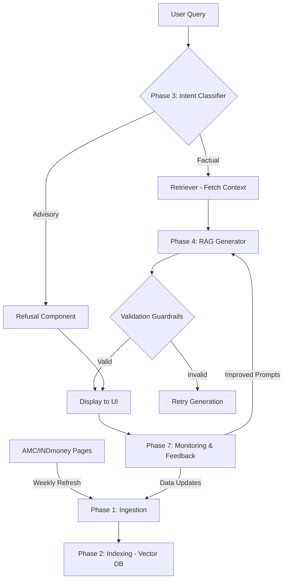

# 🏗️ Architecture Design: RAG-based Tata Mutual Fund FAQ Chatbot

This document outlines the phase-wise architecture design for a Specialized RAG (Retrieval-Augmented Generation) system focused on providing factual, scheme-level information for Tata Mutual Fund funds.

## 📌 Design Philosophy
- **Factual Grounding**: Every response must be derived from the provided context.
- **Strict Guardrails**: Zero advisory, zero performance predictions, and zero PII.
- **Citation Integrity**: Enforce exactly one source link per answer.
- **Conciseness**: Maximum 3-sentence responses.

---

## 🛠️ Phase-Wise System Architecture

### Phase 1: Knowledge Base Ingestion & Preprocessing
**Purpose**: Fetching and normalizing data from target sources (INDmoney, Tata AMC).

- **Folder Structure**:
  - `/ingestion`
    - `crawlers/` (Scripts for INDmoney and Tata AMC pages)
    - `parsers/` (PDF parsers for SID, KIM, Factsheets)
    - `cleaners/` (Markdown converters and PII cleaners)
  - `/data/raw/` (Persistent storage for raw files/PDFs)

- **Inputs**: URLs (INDmoney links, AMC domain).
- **Outputs**: Cleaned text chunks with high-fidelity metadata (Fund Name, Category, Section, Source URL).
- **Data Flow**: Web/PDF Source → Scraper → Text Extraction → Metadata Tagging → Staging Storage.
- **Key Detail**: Each chunk must inherit the `source_url` of its parent page/document.

### Phase 2: Embedding & Vector Indexing
**Purpose**: Converting text into mathematical representations for efficient semantic search.

- **Folder Structure**:
  - `/indexing`
    - `embedders/` (Embedding model wrappers)
    - `vector_store/` (Connection logic to Vector Database)
  - `/config/` (Chunking strategies: overlap size, chunk dimensions)

- **Inputs**: Cleaned text chunks from Phase 1.
- **Outputs**: Vectorized index in a database (e.g., Pinecone, FAISS).
- **Data Flow**: Text Chunks → Embedding Model (e.g., `text-embedding-3-small`) → Vector Database with Metadata.
- **Chunking Strategy**: Recursive Character Splitting (500-800 tokens) with 10% overlap to ensure context preservation.

### Phase 3: Retrieval & Intent Processing
**Purpose**: Identifying user intent, blocking sensitive/personal data, and retrieving facts strictly from vectors.

- **LLM Provider**: **Groq** (using Llama-3 or Mixtral models for high throughput).
- **Retrieval constraint**: **Zero-Knowledge Generation**. The LLM must not use its internal pre-trained knowledge to answer. If the vector context is empty or irrelevant, the system must return: *"The requested information is not available in the current knowledge base."*
- **Inputs**: User Query string.
- **Outputs**: Top-K context chunks from official sources + Intent Label.
- **Privacy Guardrail**: First-pass check for PII (PAN, Aadhaar, Bank Acc, OTP, Phone, Email). If detected, query is dropped with a privacy refusal message.
- **Refusal Handling**: 
  - **Out-of-Scope**: "I only respond to Tata Mutual Fund scheme-related queries."
  - **Performance/Comparison**: If asked to compare or compute returns, provide the **Official Factsheet URL** instead.

### Phase 4: RAG Core & Validation Guardrails
**Purpose**: Generating the final response using Groq and enforcing strict formatting/source rules.

- **Constraints**:
  1. **Source Integrity**: Use ONLY official public pages (Official Fund Page, AMC website, SEBI). No third-party blogs or app screenshots allowed.
  2. **No Performance Claims**: Do not compute, estimate, or compare returns. Refer to factsheet.
  3. **Response Length**: Maximum 3 sentences.
- **Output Format**: 
  - Every response must end with: `Last updated from sources: <OFFICIAL_URL>`
- **Validation Rules**:
  1. **Factual Grounding**: Verify the answer ONLY exists within the retrieved metadata.
  2. **Link Verification**: Ensure the citation is from a white-listed official domain.
  3. **PII check**: Final scan to ensure no sensitive data is leaked in the response.

### Phase 5: Automation & Data Stewardship [IMPLEMENTED]
**Purpose**: Ensuring the FAQ data stays fresh (e.g., Expense Ratios change).

- **Folder Structure**:
  - `/scheduler/refresh_pipeline.py` (Orchestrates ingestion -> indexing -> metadata update)
  - `/data/structured/courses.json` (Stores update metadata and system versioning)

- **Scheduler Feature**: Simple GitHub Action (`.github/workflows/refresh_data.yml`) that runs weekly to:
  1. Re-scrape target URLs (Phase 1).
  2. Update Vector Index.
  3. Notify system of index refresh via `courses.json`.

### Phase 6: UI Design Layer
**Purpose**: Client-side interaction.

- **Folder Structure**:
  - `/ui`
    - `components/` (ChatWindow, CitationCard, Disclaimer)
    - `styles/` (Premium aesthetic design)

- **Features**:
  - **Dynamic Feed**: Real-time message streaming.
  - **Citation UI**: The single link provided by the LLM is rendered as a clickable "View Source" button instead of a raw URL in text.
  - **Prompt Suggestions**: "What is the exit load?", "Check Riskometer", "Minimum SIP for Tata ELSS".

### Phase 7: Improvements & Operations
**Purpose**: Post-deployment system refinement, monitoring, and operational maintenance.

- **Folder Structure**:
  - `/ops`
    - `monitoring/` (Logging and dashboarding scripts)
    - `evaluations/` (Tools for citation accuracy and answer quality checks)
    - `feedback_loop/` (Ingesting user feedback for iterative improvements)
  - `/logs` (Production query logs and system performance metrics)

- **Inputs**: User interaction logs, system performance metrics, and new data sources.
- **Outputs**: Improved prompt templates, updated vector index, and reliability reports.
- **Key Responsibilities**:
  1. **Query & Log Monitoring**: Analyzing chatbot queries and system logs to detect anomalies or recurring user needs.
  2. **Failure Analysis**: Tracking retrieval failures, hallucinations, or "I don't know" responses to identify gaps in the knowledge base.
  3. **Iterative Refinement**: Refining system prompts and guardrails based on real-world edge cases.
  4. **Dynamic Data Stewardship**: Onboarding new data sources or updating existing ones as scheme details change.
  5. **Accuracy Evaluation**: Periodically auditing citation accuracy and factual grounding using LLM-as-a-judge or human review.
  6. **Performance Tuning**: Monitoring the latency and throughput of the vector database and retrieval pipeline.
  7. **Reliability Maintenance**: Debugging issues and maintaining system uptime through CI/CD and operational alerts.

---

## 🔄 Data Flow Summary



## 📂 Folder Structure Overview

```text
/rag-mutual-fund-chatbot
├── .github/workflows/refresh_data.yml  # Phase 5: Scheduler
├── ingestion/                          # Phase 1: Scrapers & Parsers
├── indexing/                           # Phase 2: Embedding Logic
├── core/                               # Phase 3 & 4: Retrieval & LLM
│   ├── intent/                         # Refusal Handling
│   ├── prompt_manager.py               # Citation & Constraint Logic
│   └── validators.py                   # Length & Advice checks
├── ui/                                 # Phase 6: Frontend (React/Streamlit)
├── ops/                                # Phase 7: Monitoring & Evaluations
├── config/                             # Constants & Settings
└── data/                               # Local storage for PDFs/Cache
```

## ⚖️ Citation & Refusal Governance
| Rule | Implementation Method |
| :--- | :--- |
| **Retrieval Only** | Prompt logic: "Answer ONLY from context. If not present, state unavailability." |
| **LLM Provider** | Integrated via **Groq Cloud API**. |
| **Source Attribution** | Mandatory suffix: "Last updated from sources: <URL>". |
| **Official Sources** | White-listed domains only (AMC, SEBI, Official Fund Pages). No third-party blogs. |
| **Max 3 Sentences** | Enforced via system prompt and regex validation. |
| **No PII/Sensitive** | Bi-directional scanning for PAN, Aadhaar, Bank Details, etc. |
| **No Performance** | Intent classifier identifies "Comparison" and redirects to Factsheet/Official URLs. |
| **No "Pre-trained" Knowledge** | Temperature set to 0 and specific "grounding" system instructions. |
